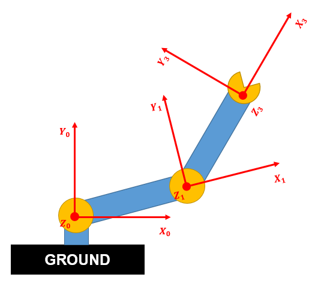
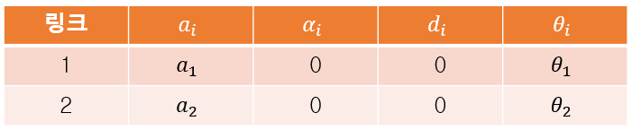
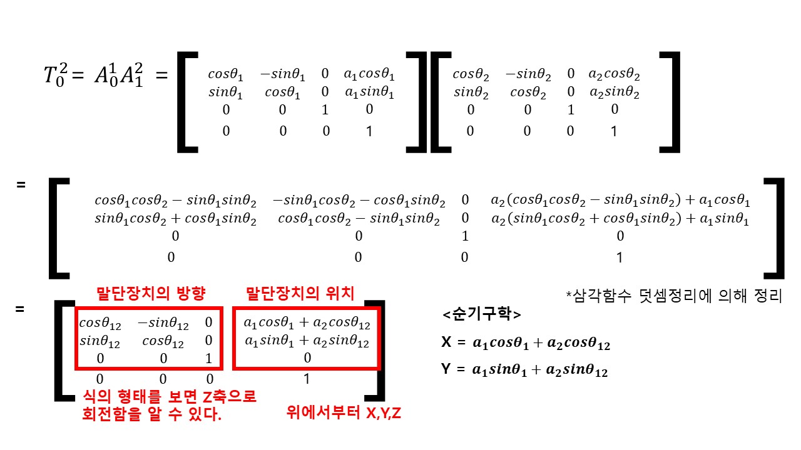
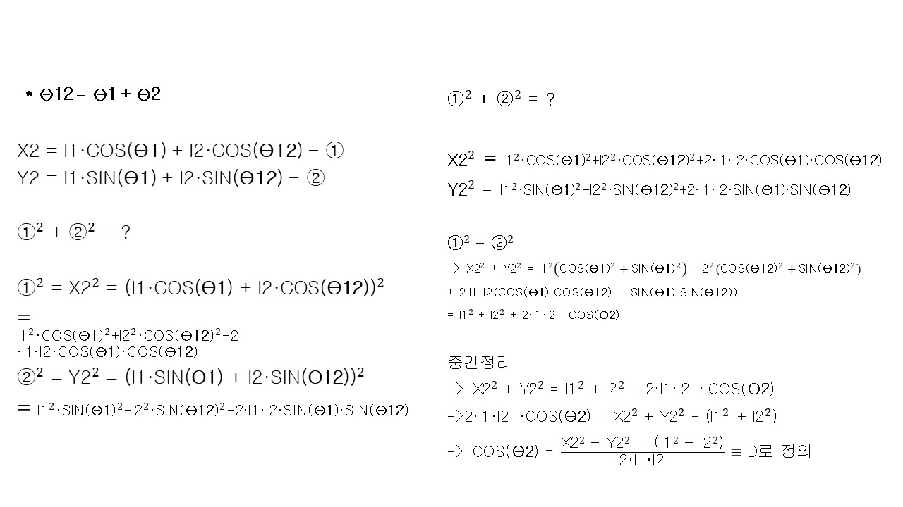
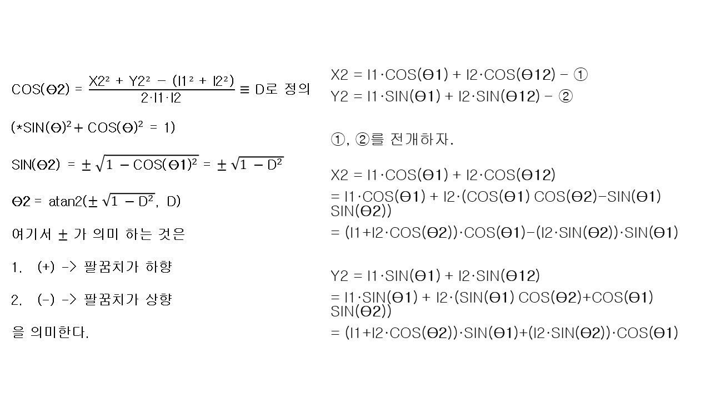
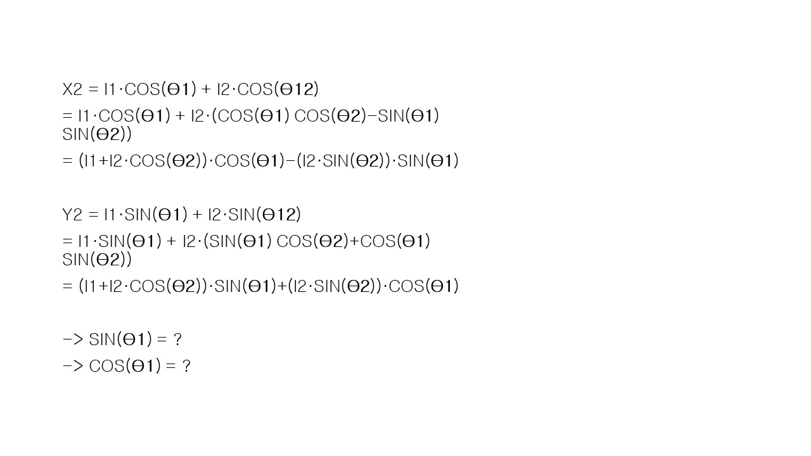
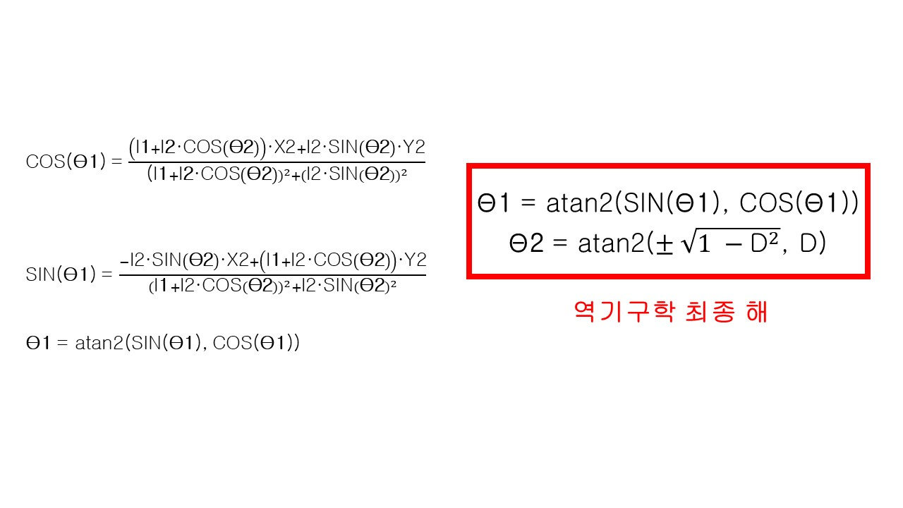
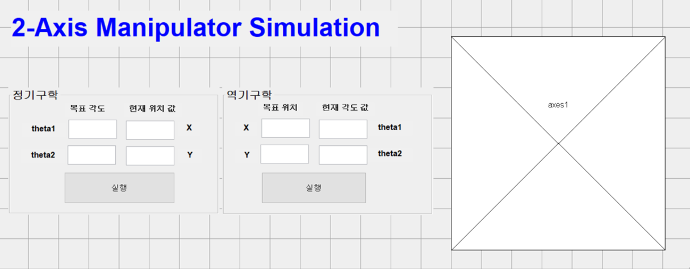

# Introduce
안녕하세요. 오늘은 매틀랩으로 로봇팔을 시뮬레이션하는 툴박스인 Robotics toolbox를 소개해드리겠습니다.
동시에 제일 간단한 2축 매니퓰레이터의 DH파라미터와 순기구학 역기구학 식을 구하여 식이 잘 풀렸는지 검증해보겠습니다.

# What is Robotics toolbox

링크 : http://petercorke.com/wordpress/toolboxes/robotics-toolbox

Robotics toolbox는 로봇팔에 관해서 시뮬레이션을 해볼 수 있는 좋은 툴입니다. 내가 푼 기구학이 제대로 풀렸는지 그리고 End-Effector의 궤적이 잘 그려지는지 등 각속도, 각가속도를 뽑아내서 그래프를 그려서 다양하게 이용할 수 있습니다.

우선 이 툴박스를 이용하려면 매틀랩의 버전의 "2018a이상"이어야 합니다.

위 링크에 들어가서 zip파일을 다운로드 하겠습니다.

노란색 형광펜 부분을 클릭하여 zip파일을 다운로드 해주세요.

그리고 압축을 풀어서 startup_rvc 파일을 실행시켜주세요.

실행을 하면 작업공간에 변수들이 추가되어 있으면 성공입니다.

이제 Robotics Toolbox를 사용할 수 있습니다.

# 2 axis robot arm DH-Parameter

오늘 시뮬레이션을 해볼 로봇은 2축 스카라 로봇 팔입니다.

이 로봇을 수학적으로 바라보기 위해서 좌표계를 도입하고 각 축의 각도와 링크를 문자로 나타내보겠습니다.

이 로봇의 DH-Parameter를 구해보겠습니다.

참고로 DH-Parameter란 로봇 팔을 하나의 표로 나타낼 수 있는 것을 말합니다.

### DH Parameters (Denavit-Hartenberg)

1) z축 기준으로 d만큼 이동
2) z축 기준으로 theta만큼 회전
3) x축 기준으로 a만큼 이동
4) x축을 기준으로 alpha만큼 회전

# Forward Kinematics

이 로봇의 순기구학을 다음과 같이 구할 수 있습니다.

# Inverse Kinematics

이 로봇의 역기구학을 다음과 같이 구할 수 있습니다.

# GUI

푸쉬 버튼, 편집 텍스트, 정적 테스트, 패널, 좌표 축 추가해서 다음과 같이 구성합니다.

# Code
### 준비중...

# Simulation
### 준비중...

